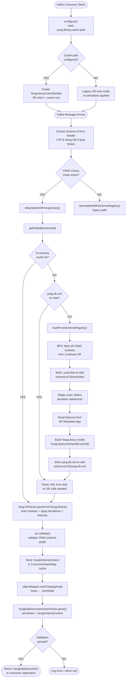
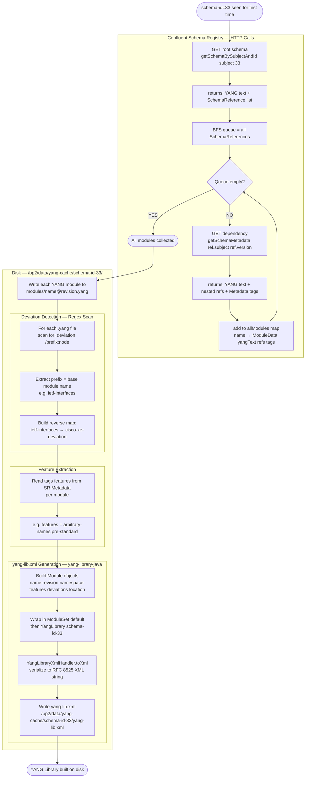

# YANG Library (RFC 8525) Support

This document describes the YANG Library integration added to `yang-kafka-integration`,
enabling correct deserialization of YANG-modelled Kafka messages with **vendor deviations**
and **conditional features** applied.

---

## Table of Contents

1. [Why YANG Library?](#1-why-yang-library)
2. [High-Level Flow Overview](#2-high-level-flow-overview)
3. [Phase 1 — Building the YANG Library](#3-phase-1--building-the-yang-library)
4. [Phase 2 — Using the YANG Library to Validate Messages](#4-phase-2--using-the-yang-library-to-validate-messages)
5. [Detailed Code Flow with Line Numbers](#5-detailed-code-flow-with-line-numbers)
6. [Disk Cache Layout](#6-disk-cache-layout)
7. [yang-lib.xml Structure](#7-yang-libxml-structure)
8. [Configuration](#8-configuration)
9. [New Components](#9-new-components)
10. [Dependencies Added](#10-dependencies-added)
11. [Log Messages Reference](#11-log-messages-reference)
12. [Modified Files Summary](#12-modified-files-summary)

---

## 1. Why YANG Library?

### Problem with the original SR-only path

The original deserialization called `YangSchemaUtils.parseYangString()` on each raw YANG module
fetched from Confluent Schema Registry. This parses YANG text in isolation with no awareness of:

- **Deviations** — RFC 7950 `deviation` statements that vendors use to remove or modify standard
  YANG nodes (e.g., mark a mandatory leaf as `deviate not-supported`). Without applying them,
  validation of real router data produces false failures because the standard YANG says a field
  is mandatory but the device never sends it.
- **Features** — RFC 7950 `if-feature` guards. Without knowing which features are enabled on
  the target device, nodes guarded by `if-feature` may be incorrectly included or excluded.

### Solution: RFC 8525 YANG Library

A `yang-lib.xml` file explicitly binds each YANG module to:
- Its list of enabled features
- Its list of deviation modules

This implementation auto-generates that file from Schema Registry data on the first message
received for each `schema-id`, then caches it on disk and in memory forever after.

---

## 2. High-Level Flow Overview



---

## 3. Phase 1 — Building the YANG Library

This phase runs **once per schema-id** on the first ever message received. After this, the
result is persisted to disk and never runs again unless the cache is deleted.



**What ends up on disk after this phase:**

```
/bp2/data/yang-cache/schema-id-33/
  yang-lib.xml                              ← RFC 8525 XML
  modules/
    ietf-interfaces@2018-02-20.yang         ← raw YANG text from SR
    ietf-ip@2018-02-22.yang
    ietf-yang-push.yang
    ...
```

---

## 4. Phase 2 — Using the YANG Library to Validate Messages

This phase runs **on every Kafka message** after the library is built. It uses the
`YangSchemaContext` loaded from `yang-lib.xml` to parse and validate the JSON payload.

```mermaid
flowchart TD
    A([Kafka message bytes arrive]) --> B

    subgraph CACHE ["YangLibraryCacheBuilder.getOrBuild"]
        B{In-memory\nConcurrentHashMap hit?}
        B -- YES --- C([Return YangSchemaContext immediately\nzero I/O])
        B -- NO --> D{yang-lib.xml\nexists on disk?}
        D -- YES --> E[YangYinParser.parseFromYangLibrary\nyangLibXml modulesDir]
        D -- NO --> F[buildFromSchemaRegistry\nsee Phase 1]
        F --> E
        E --> E1

        subgraph PARSE ["YangLibraryParser.parse — inside yangkit-parser"]
            E1[SAXReader reads yang-lib.xml\nbuild DOM tree]
            E1 --> E2[parseModuleSets\nparseModuleEntry per module]
            E2 --> E3[Read each module entry:\nname revision namespace\nfeature list\ndeviation list\nlocation file://path]
            E3 --> E4[loadModule\nfor each import-only dep first\nthen main modules]
            E4 --> E5[YangYinParser.parse FileInputStream\nparse .yang file into YangSchemaContext]
            E5 --> E6[buildYangSchema\nattach feature + deviation metadata]
            E6 --> E7[desc.addFeature feature\ndesc.addDeviation deviation\nTHIS is what applies deviations]
        end

        E7 --> G[ctx.validate\nvalidate full YANG schema graph\nimports types identities]
        G --> H[contextCache.put schemaId ctx\nstore in ConcurrentHashMap]
        H --> C
    end

    C --> I[objectMapper.readTree payload\nparse raw bytes to Jackson JsonNode]
    I --> J[new YangDataDocumentJsonParser ctx\nparser with deviation-aware schema]
    J --> K[parser.parse jsonNode resultBuilder\nwalk JSON tree against YANG schema]

    subgraph VALIDATE ["JSON Validation Against YANG Schema"]
        K --> K1{JSON field present\nin YANG schema?}
        K1 -- YES --> K2{Field deviated\nnot-supported?}
        K2 -- NO --> K3[validate value type\nrange pattern length]
        K2 -- YES --> K4[skip field\ndeviation applied correctly]
        K1 -- NO --> K5[unknown property\nfail if yang.json.fail.unknown.properties=true]
    end

    K3 --> L[resultBuilder accumulates\nValidatorRecord entries]
    K4 --> L
    K5 --> L
    L --> M{resultBuilder.build.isOk\nand yang.json.fail.invalid.schema=true?}
    M -- FAIL --> N([log getRecords\nreturn null])
    M -- OK --> O([Return YangDataDocument\nto consumer application])
```



---

## 5. Detailed Code Flow with Line Numbers

### Consumer startup — `AbstractKafkaYangJsonSchemaDeserializer.configure()` lines 62–82

| Line | Code | Purpose |
|------|------|---------|
| 19 | `import YangLibraryCacheBuilder` | new import |
| 41 | `import ValidatorResultBuilder` | new import |
| 43 | `import YangDataDocumentJsonParser` | new import |
| 60 | `private YangLibraryCacheBuilder yangLibraryCacheBuilder` | new field — null = legacy mode |
| 72 | `config.getString(YANG_LIBRARY_CACHE_PATH)` | reads `yang.library.cache.path` |
| 73 | `if (cachePath != null && !cachePath.isBlank())` | default is `/bp2/data/yang-cache` → true |
| 75 | `cacheRoot.mkdirs()` | creates `/bp2/data/yang-cache/` on disk |
| 76 | `new YangLibraryCacheBuilder(schemaRegistry, cacheRoot)` | wires SR client + cache path |

### Config default — `KafkaYangJsonSchemaDeserializerConfig.java`

| Line | Code | Purpose |
|------|------|---------|
| 45 | `YANG_LIBRARY_CACHE_PATH = "yang.library.cache.path"` | config key constant |
| 46 | `YANG_LIBRARY_CACHE_PATH_DEFAULT = "/bp2/data/yang-cache"` | default path inside pod |
| 90 | `.define(YANG_LIBRARY_CACHE_PATH, Type.STRING, ...)` | registered in Kafka ConfigDef |

### Message arrives — `deserialize()` lines 103–138

| Line | Code | Purpose |
|------|------|---------|
| 115 | `headers.lastHeader(SCHEMA_ID_KEY).value()` | read raw `schema-id` header bytes |
| 117 | `Integer.parseInt(new String(bytes, UTF_8).trim())` | try 1: NetGauze UTF-8 string `"33"` |
| 119 | `ByteBuffer.wrap(bytes).getInt()` | try 2: Java serializer 4-byte binary |
| 134 | `if (yangLibraryCacheBuilder != null)` | YANG Library mode is active |
| 135 | `return deserializeWithYangLibrary(id, ...)` | go to new path |
| 138 | `return deserializeWithSchemaRegistry(...)` | old path — only if cache path is empty |

### YANG Library deserialization — `deserializeWithYangLibrary()` lines 156–195

| Line | Code | Purpose |
|------|------|---------|
| 161 | `subject = getContextName(topic)` | resolve SR subject name |
| 164 | `yangLibraryCacheBuilder.getOrBuild(schemaId, subject)` | core cache call |
| 165 | `objectMapper.readTree(payload)` | parse raw bytes → Jackson `JsonNode` |
| 167 | `new ValidatorResultBuilder()` | accumulator for validation errors |
| 168 | `new YangDataDocumentJsonParser(ctx)` | parser bound to deviation-aware schema context |
| 169 | `parser.parse(jsonNode, resultBuilder)` | validate + build `YangDataDocument` |
| 171 | `resultBuilder.build().isOk()` | check if any validation errors occurred |
| 173 | `resultBuilder.build().getRecords()` | get validation error list (`getRecords()` not `getResults()`) |
| 176 | `return doc` | return to consumer application |

### Cache lookup — `YangLibraryCacheBuilder.getOrBuild()` lines 122–148

| Line | Code | Purpose |
|------|------|---------|
| 88 | `NAMESPACE_PATTERN` | regex: extract `namespace "..."` from YANG text |
| 90 | `REVISION_PATTERN` | regex: extract `revision "YYYY-MM-DD"` from YANG text |
| 93 | `DEVIATION_TARGET_PATTERN` | regex: extract base module name from `deviation "/prefix:node"` |
| 96 | `ConcurrentHashMap<Integer, YangSchemaContext>` | thread-safe in-memory cache |
| 123 | `contextCache.get(schemaId)` | TIER 1: in-memory hit — fastest, zero I/O |
| 126–128 | build `cacheDir`, `yangLibXml`, `modulesDir` paths | resolve `/bp2/data/yang-cache/schema-id-33/` |
| 130 | `if (!yangLibXml.exists())` | TIER 2: disk miss — need SR call |
| 138 | `YangYinParser.parseFromYangLibrary(yangLibXml, modulesDir)` | parse from disk |
| 139 | `ctx.validate()` | validate YANG schema graph |
| 140 | `contextCache.put(schemaId, ctx)` | promote to TIER 1 memory |

### SR fetch — `fetchAllModules()` lines 222–260

| Line | Code | Purpose |
|------|------|---------|
| 225 | `schemaRegistry.getSchemaBySubjectAndId(subject, schemaId)` | SR HTTP: get root module |
| 228 | `result.put(rootName, new ModuleData(...))` | store root module data |
| 233 | `Queue<SchemaReference> queue = new ArrayDeque<>(rootParsed.references())` | BFS queue |
| 243 | `schemaRegistry.getSchemaMetadata(ref.getSubject(), ref.getVersion())` | SR HTTP: each dependency |
| 249 | `extractTags(meta.getMetadata())` | convert `SortedMap<String,SortedSet<String>>` → `Map<String,List<String>>` |
| 252 | `queue.addAll(nestedRefs)` | recurse into sub-dependencies |

### Write files — `writeYangFiles()` lines 267–284

| Line | Code | Purpose |
|------|------|---------|
| 275 | `extractRevision(yangText)` | regex: find `revision "2018-02-20"` |
| 277 | `name + "@" + revision + ".yang"` | filename: `ietf-interfaces@2018-02-20.yang` |
| 280 | `Files.writeString(yangFile.toPath(), yangText, UTF_8)` | write to `modules/` directory |

### Deviation scan — `buildDeviationMap()` + `extractDeviatedModuleNames()` lines 292–317

| Line | Code | Purpose |
|------|------|---------|
| 296 | `extractDeviatedModuleNames(yangText)` | scan one module's YANG text |
| 313 | `DEVIATION_TARGET_PATTERN.matcher(yangText)` | find all `deviation "/prefix:..."` |
| 315 | `result.add(m.group(1))` | capture `prefix` = name of the deviated module |
| 300 | `deviationMap.computeIfAbsent(deviatedModule, ...).add(devModuleName)` | build reverse map |

### XML generation — `buildFromSchemaRegistry()` lines 165–214

| Line | Code | Purpose |
|------|------|---------|
| 173 | `data.tags.getOrDefault("features", emptyList())` | get enabled features per module |
| 174 | `deviationMap.getOrDefault(name, emptyList())` | get deviation modules for this module |
| 178 | `"file://" + absolutePath` | location URI so `YangLibraryParser` can find the file directly |
| 181 | `new Module(name, revision, namespace, features, deviations, ..., locations)` | yanglib-java model |
| 206 | `new ModuleSet("default", modules, ...)` | wrap modules in a named module set |
| 210 | `new YangLibrary("schema-id-33", moduleSets, ...)` | top-level RFC 8525 object |
| 213 | `YangLibraryXmlHandler.toXml(yangLibrary)` | serialize to RFC 8525 XML string |
| 214 | `Files.writeString(yangLibXml.toPath(), xml, UTF_8)` | write `/bp2/data/yang-cache/schema-id-33/yang-lib.xml` |

### XML parsing — `YangYinParser.parseFromYangLibrary()` → `YangLibraryParser.parse()`

**YangYinParser.java** (yangkit-parser)

| Line | Code | Purpose |
|------|------|---------|
| 23 | `YangStatementImplRegister.registerImpl()` | static init: register all YANG statement implementations |
| 46 | `parseFromYangLibrary(File xmlFile, File yangSearchPath)` | overload 1 — File + File |
| 61 | `parseFromYangLibrary(InputStream xmlStream, File yangSearchPath)` | overload 2 — stream |
| 72 | `parseFromYangLibrary(String xmlFilePath, String yangSearchPath)` | overload 3 — string paths |
| 48, 63, 74 | `return YangLibraryParser.parse(...)` | all delegate to `YangLibraryParser` |

**YangLibraryParser.java** (yangkit-parser)

| Line | Code | Purpose |
|------|------|---------|
| 62 | `SAXReader.createDefault().read(xmlFile)` | parse `yang-lib.xml` into DOM |
| 101 | `parseRoot(doc.getRootElement(), yangSearchPath)` | start processing |
| 113 | load import-only modules first | dependencies must be available before main modules |
| 117 | load main modules | main YANG modules |
| 167–193 | `parseModuleEntry(elem)` | reads `<name>`, `<revision>`, `<feature>`, `<deviation>`, `<location>` |
| 174 | `features.add(child.getTextTrim())` | collect `<feature>` elements |
| 177 | `deviations.add(child.getTextTrim())` | collect `<deviation>` elements |
| 249 | `if (location.startsWith("file://"))` | try absolute path from XML first |
| 251 | `YangYinParser.parse(new FileInputStream(f), ...)` | parse the `.yang` file |
| 224 | `desc.addFeature(feature)` | **bind feature to module descriptor** |
| 227 | `desc.addDeviation(deviation)` | **bind deviation — this makes deviations apply during validate()** |

---

## 6. Disk Cache Layout

```
/bp2/data/yang-cache/              ← default: yang.library.cache.path
  schema-id-33/
    yang-lib.xml                   ← RFC 8525 XML generated once from SR
    modules/
      ietf-interfaces@2018-02-20.yang
      ietf-ip@2018-02-22.yang
      ietf-yang-push.yang
      ietf-subscribed-notifications.yang
      ...
  schema-id-34/
    yang-lib.xml
    modules/
      ...
```

| File | Written when | Purpose |
|------|-------------|---------|
| `yang-lib.xml` | First message for schema-id (SR not contacted again after) | RFC 8525 descriptor — binds modules to features + deviations |
| `modules/*.yang` | Same time as yang-lib.xml | Raw YANG source text fetched from SR |

---

## 7. yang-lib.xml Structure

```xml
<yang-library xmlns="urn:ietf:params:xml:ns:yang:ietf-yang-library">
  <content-id>schema-id-33</content-id>
  <module-set>
    <name>default</name>

    <!-- Standard module with vendor deviations and features -->
    <module>
      <name>ietf-interfaces</name>
      <revision>2018-02-20</revision>
      <namespace>urn:ietf:params:xml:ns:yang:ietf-interfaces</namespace>
      <feature>arbitrary-names</feature>           <!-- from SR Metadata.tags["features"] -->
      <deviation>cisco-xe-ietf-interfaces-dev</deviation>  <!-- auto-detected by regex -->
      <location>file:///bp2/data/yang-cache/schema-id-33/modules/ietf-interfaces@2018-02-20.yang</location>
    </module>

    <!-- Deviation module (vendor-specific, no deviations of its own) -->
    <module>
      <name>cisco-xe-ietf-interfaces-dev</name>
      <revision>2024-01-01</revision>
      <namespace>http://cisco.com/xe/yang/...</namespace>
      <location>file:///bp2/data/yang-cache/schema-id-33/modules/cisco-xe-ietf-interfaces-dev.yang</location>
    </module>

    <!-- If no vendor deviations in SR, modules have no <deviation> element -->
    <module>
      <name>ietf-yang-push</name>
      <revision>2019-09-09</revision>
      <namespace>urn:ietf:params:xml:ns:yang:ietf-yang-push</namespace>
      <location>file:///bp2/data/yang-cache/schema-id-33/modules/ietf-yang-push.yang</location>
    </module>

  </module-set>
</yang-library>
```

---

## 8. Configuration

```java
// YANG Library mode is ON by default in the pod (default = /bp2/data/yang-cache)
// No config needed unless you want to override the path or disable the feature.

// Override path:
props.put("yang.library.cache.path", "/bp2/data/yang-cache");

// Disable YANG Library mode (fall back to legacy SR-only path):
props.put("yang.library.cache.path", "");

// Surface validation errors as log errors and return null for invalid messages:
props.put("yang.json.fail.invalid.schema", "true");

// Standard SR + deserializer config:
props.put("schema.registry.url", "http://schema-registry:8081");
props.put(ConsumerConfig.VALUE_DESERIALIZER_CLASS_CONFIG,
    "ch.swisscom.kafka.serializers.yang.json.KafkaYangJsonSchemaDeserializer");
```

### All config keys

| Key | Type | Default | Description |
|-----|------|---------|-------------|
| `yang.library.cache.path` | String | `/bp2/data/yang-cache` | Root directory for YANG Library disk cache. Empty string = disable YANG Library mode. |
| `yang.json.fail.invalid.schema` | Boolean | `false` | Return `null` and log errors when YANG validation fails. |
| `yang.json.fail.unknown.properties` | Boolean | `true` | Fail on unknown JSON properties. |

---

## 9. New Components

### `YangLibraryCacheBuilder` — `yang-schema-registry-plugin`

**Full path:** `yang-schema-registry-plugin/src/main/java/ch/swisscom/kafka/schemaregistry/yang/YangLibraryCacheBuilder.java`

| Responsibility | How |
|----------------|-----|
| Fetch all YANG modules from SR | BFS over `SchemaReference` chains from the root schema |
| Write `.yang` files to disk | `Files.writeString()` with `name@revision.yang` filenames |
| Detect deviation relationships | Regex scan: `\bdeviation\s+[\"']?/([^:/\"'\s]+):` |
| Extract enabled features | `Metadata.getTags()["features"]` per module |
| Generate RFC 8525 XML | `YangLibraryXmlHandler.toXml(YangLibrary)` from `yanglib-java` |
| Cache in memory | `ConcurrentHashMap<Integer, YangSchemaContext>` |

### `YangLibraryParser` — `yangkit-parser`

**Full path:** `yangkit/yangkit-parser/src/main/java/org/yangcentral/yangkit/parser/YangLibraryParser.java`

Reads `yang-lib.xml`, loads `.yang` files, and builds a `YangSchemaContext` with deviations
and features bound via `YangModuleDescription.addDeviation()` / `.addFeature()`.

### `YangYinParser.parseFromYangLibrary()` — `yangkit-parser`

**Full path:** `yangkit/yangkit-parser/src/main/java/org/yangcentral/yangkit/parser/YangYinParser.java`

Three new static overloads (lines 46, 61, 72) that delegate to `YangLibraryParser.parse()`.

---

## 10. Dependencies Added

### `yang-schema-registry-plugin/pom.xml` and `yang-json-schema-serializer/pom.xml`

```xml
<dependency>
  <groupId>com.netgauze</groupId>
  <artifactId>yanglib-java</artifactId>
  <version>1.0.0</version>
</dependency>
```

`yanglib-java` provides `YangLibrary`, `ModuleSet`, `Module`, `YangLibraryXmlHandler`. Zero
external dependencies. Must be installed to local Maven repo:

```bash
mvn install:install-file \
  -Dfile=yanglib-java-1.0.0.jar \
  -DgroupId=com.netgauze \
  -DartifactId=yanglib-java \
  -Dversion=1.0.0 \
  -Dpackaging=jar
```

---

## 11. Log Messages Reference

| Level | Message | What it means |
|-------|---------|---------------|
| `INFO` | `YANG Library mode enabled. Cache root: /bp2/data/yang-cache` | Config was set, builder initialised |
| `INFO` | `YANG Library mode disabled – using Schema Registry path only` | Config not set or empty, legacy path active |
| `INFO` | `Building YANG Library cache for schema-id=33 subject=<topic>-value` | First message for this schema-id, SR will be contacted |
| `INFO` | `Generated yang-lib.xml at /bp2/data/.../yang-lib.xml with 28 modules` | XML written successfully to disk |
| `INFO` | `YANG Library schema loaded for schema-id=33: 28 modules` | Context built, validated, stored in memory |
| `DEBUG` | `Reusing existing YANG Library cache for schema-id=33` | Disk cache hit on JVM restart |
| `DEBUG` | `Fetched 28 YANG modules from SR for schema-id=33` | BFS complete |
| `ERROR` | `YANG JSON validation failed for schema-id=33: [...]` | Payload failed YANG validation (only when `yang.json.fail.invalid.schema=true`) |
| `ERROR` | `Error deserializing YANG JSON via YANG Library for schema-id=33: ...` | Unexpected exception during deserialization |

---

## 12. Modified Files Summary

| File | Type | Change |
|------|------|--------|
| `yang-schema-registry-plugin/.../YangLibraryCacheBuilder.java` | **New** | Builds RFC 8525 cache from SR data |
| `yang-schema-registry-plugin/pom.xml` | Modified | Added `yanglib-java:1.0.0` dependency |
| `yang-json-schema-serializer/.../AbstractKafkaYangJsonSchemaDeserializer.java` | Modified | Added `yangLibraryCacheBuilder` field; branching deserialize → YANG Library or legacy path |
| `yang-json-schema-serializer/.../KafkaYangJsonSchemaDeserializerConfig.java` | Modified | Added `yang.library.cache.path` config key with default `/bp2/data/yang-cache` |
| `yang-json-schema-serializer/pom.xml` | Modified | Added `yanglib-java:1.0.0` dependency |
| `yangkit/.../YangLibraryParser.java` | **New** | RFC 8525 XML → `YangSchemaContext` parser |
| `yangkit/.../YangYinParser.java` | Modified | Added 3 `parseFromYangLibrary()` overloads |
| `yangkit/.../NetGauzeYangKafkaConsumer.java` | **New** | Example consumer using local YANG Library cache |


The original deserialization path used Confluent Schema Registry (SR) to fetch raw YANG text
and build a `YangSchemaContext` via `YangSchemaUtils.parseYangString()`. This approach has a
critical limitation: **device-specific deviations are silently ignored**.

RFC 7950 `deviation` statements let vendors remove or modify standard YANG nodes (e.g., marking
a mandatory leaf as `deviate not-supported`). Without applying those deviations, validation of
real device data will produce false failures.

RFC 8525 YANG Library solves this by explicitly binding each module to its deviation modules and
enabled features in a single `yang-lib.xml` file. This implementation auto-generates that file
from SR data and uses it to build the schema context.

---

## Architecture

```
Kafka message arrives (schema-id header = 42)
         │
         ▼
AbstractKafkaYangJsonSchemaDeserializer.deserialize()
         │
         ├── yang.library.cache.path set?
         │         │
         │        YES ──► deserializeWithYangLibrary(schemaId=42)
         │                        │
         │              YangLibraryCacheBuilder.getOrBuild(42, subject)
         │                        │
         │              ┌─────────┴──────────┐
         │              │ in-memory cache hit? │
         │              └─────────┬──────────┘
         │                   NO  │  YES → return cached YangSchemaContext
         │                        │
         │              ┌─────────┴──────────┐
         │              │  yang-lib.xml on disk? │
         │              └─────────┬──────────┘
         │                   NO  │  YES → parse from disk (no SR call)
         │                        │
         │              buildFromSchemaRegistry()
         │                 1. BFS fetch all modules from SR
         │                 2. Write modules/*.yang to disk
         │                 3. Regex-scan for deviation statements
         │                 4. Read features from SR Metadata.tags
         │                 5. Build RFC 8525 yang-lib.xml via yang-library-java
         │                        │
         │              YangYinParser.parseFromYangLibrary(yangLibXml, modulesDir)
         │                 → YangSchemaContext (deviations + features applied)
         │                        │
         │              YangDataDocumentJsonParser.parse(jsonNode, resultBuilder)
         │                 → YangDataDocument
         │
         └── yang.library.cache.path not set → legacy SR-only path (no deviation support)
```

---

## New Components

### `yang-schema-registry-plugin` — `YangLibraryCacheBuilder`

**File:** `yang-schema-registry-plugin/src/main/java/ch/swisscom/kafka/schemaregistry/yang/YangLibraryCacheBuilder.java`

Builds and caches RFC 8525 YANG Library artifacts from Confluent SR data.

Key responsibilities:
- **BFS over SchemaReferences**: starting from the root schema, recursively fetches all
  dependent YANG modules via `schemaRegistry.getSchemaMetadata(subject, version)`.
- **Deviation detection**: scans each YANG module text for `deviation "/prefix:..."` patterns
  and builds a reverse map of `base-module → [deviation-modules]`.
- **Feature extraction**: reads `Metadata.getTags()["features"]` per module from SR.
- **yang-lib.xml generation**: uses `com.netgauze:yanglib-java:1.0.0` to serialize an RFC 8525
  `YangLibrary` model to XML.
- **Disk cache**: writes `<cacheRoot>/schema-id-<N>/yang-lib.xml` + `modules/*.yang`.
- **In-memory cache**: holds a `ConcurrentHashMap<Integer, YangSchemaContext>` per JVM instance.

Cache access tiers (fastest to slowest):

| Tier | Condition | SR called? |
|------|-----------|-----------|
| In-memory | Same JVM, same schema-id seen before | No |
| Disk | JVM restarted, `yang-lib.xml` exists on disk | No |
| Schema Registry | First ever access for this schema-id | **Yes** |

### `yangkit-parser` — `YangLibraryParser` + `YangYinParser.parseFromYangLibrary()`

**Files (in `yangkit` repo):**
- `yangkit-parser/src/main/java/org/yangcentral/yangkit/parser/YangLibraryParser.java`
- `yangkit-parser/src/main/java/org/yangcentral/yangkit/parser/YangYinParser.java` (3 new overloads)

`YangLibraryParser` reads an RFC 8525 `yang-lib.xml` and builds a `YangSchemaContext` with
deviations and features applied. Entry point:

```java
YangSchemaContext ctx = YangYinParser.parseFromYangLibrary(yangLibXml, modulesDir);
ctx.validate();
```

---

## Disk Cache Layout

Mirrors NetGauze's local cache so that a pre-populated cache from a NetGauze deployment can
be used directly without contacting SR at all.

```
<yang.library.cache.path>/
  schema-id-42/
    yang-lib.xml                              ← RFC 8525 XML, generated from SR data
    modules/
      ietf-interfaces@2018-02-20.yang
      ietf-ip@2018-02-22.yang
      cisco-xe-ietf-interfaces-deviation.yang
      ...
  schema-id-43/
    yang-lib.xml
    modules/
      ...
```

### `yang-lib.xml` structure

```xml
<yang-library xmlns="urn:ietf:params:xml:ns:yang:ietf-yang-library">
  <content-id>schema-id-42</content-id>
  <module-set>
    <name>default</name>
    <module>
      <name>ietf-interfaces</name>
      <revision>2018-02-20</revision>
      <namespace>urn:ietf:params:xml:ns:yang:ietf-interfaces</namespace>
      <feature>arbitrary-names</feature>           <!-- from SR Metadata.tags["features"] -->
      <deviation>cisco-xe-ietf-interfaces-deviation</deviation>  <!-- auto-detected -->
      <location>file:///...path.../ietf-interfaces@2018-02-20.yang</location>
    </module>
    <module>
      <name>cisco-xe-ietf-interfaces-deviation</name>
      ...
    </module>
  </module-set>
</yang-library>
```

---

## Configuration

Add one property to your Kafka consumer configuration to enable YANG Library mode:

```java
// Enable YANG Library path (deviations + features applied)
props.put("yang.library.cache.path", "/var/lib/yang-cache");

// Optional: surface validation errors as log errors and return null
props.put("yang.json.fail.invalid.schema", "true");

// Standard SR + deserializer config
props.put("schema.registry.url", "http://localhost:8081");
props.put(ConsumerConfig.VALUE_DESERIALIZER_CLASS_CONFIG,
    "ch.swisscom.kafka.serializers.yang.json.KafkaYangJsonSchemaDeserializer");
```

If `yang.library.cache.path` is **not set**, the original legacy SR-only path is used
(backward compatible — no behaviour change for existing consumers).

### All config keys

| Key | Type | Default | Description |
|-----|------|---------|-------------|
| `yang.library.cache.path` | String | `null` | Path to the YANG Library disk cache root. When set, enables YANG Library mode. |
| `yang.json.fail.invalid.schema` | Boolean | `false` | Return `null` and log an error when YANG validation fails. |
| `yang.json.fail.unknown.properties` | Boolean | `true` | Fail on unknown JSON properties during deserialization. |

---

## Dependencies Added

### `yang-schema-registry-plugin/pom.xml`

```xml
<dependency>
  <groupId>com.netgauze</groupId>
  <artifactId>yanglib-java</artifactId>
  <version>1.0.0</version>
</dependency>
```

### `yang-json-schema-serializer/pom.xml`

```xml
<dependency>
  <groupId>com.netgauze</groupId>
  <artifactId>yanglib-java</artifactId>
  <version>1.0.0</version>
</dependency>
```

`yanglib-java` provides the RFC 8525 model classes (`YangLibrary`, `ModuleSet`, `Module`) and
`YangLibraryXmlHandler.toXml()` / `fromXml()`. It has zero external dependencies and must be
installed to the local Maven repository:

```bash
mvn install:install-file \
  -Dfile=yanglib-java-1.0.0.jar \
  -DgroupId=com.netgauze \
  -DartifactId=yanglib-java \
  -Dversion=1.0.0 \
  -Dpackaging=jar
```

---

## Log Messages Reference

| Level | Message | Meaning |
|-------|---------|---------|
| `INFO` | `YANG Library mode enabled. Cache root: <path>` | `yang.library.cache.path` is set and the builder is initialised |
| `INFO` | `YANG Library mode disabled – using Schema Registry path only` | Config key not set; legacy path will be used |
| `INFO` | `Building YANG Library cache for schema-id=N subject=<s>` | First access; SR will be contacted |
| `INFO` | `Generated yang-lib.xml at <path> with N modules` | XML written successfully |
| `INFO` | `YANG Library schema loaded for schema-id=N: N modules` | Context built and cached in memory |
| `DEBUG` | `Reusing existing YANG Library cache for schema-id=N` | Disk cache hit on JVM restart |
| `ERROR` | `YANG JSON validation failed for schema-id=N: [...]` | Payload failed YANG validation (only logged when `yang.json.fail.invalid.schema=true`) |

---

## Modified Files Summary

| File | Change |
|------|--------|
| `yang-schema-registry-plugin/.../YangLibraryCacheBuilder.java` | **New** — builds RFC 8525 cache from SR |
| `yang-schema-registry-plugin/pom.xml` | Added `yanglib-java:1.0.0` dependency |
| `yang-json-schema-serializer/.../AbstractKafkaYangJsonSchemaDeserializer.java` | Added `yangLibraryCacheBuilder` field; branching `deserialize()` → `deserializeWithYangLibrary()` / `deserializeWithSchemaRegistry()` |
| `yang-json-schema-serializer/.../KafkaYangJsonSchemaDeserializerConfig.java` | Added `yang.library.cache.path` config key |
| `yang-json-schema-serializer/pom.xml` | Added `yanglib-java:1.0.0` dependency |
| `yangkit/yangkit-parser/.../YangLibraryParser.java` | **New** — RFC 8525 XML → `YangSchemaContext` parser |
| `yangkit/yangkit-parser/.../YangYinParser.java` | Added 3 `parseFromYangLibrary()` overloads |
| `yangkit/yangkit-examples/.../NetGauzeYangKafkaConsumer.java` | **New** — example consumer using local YANG Library cache |
